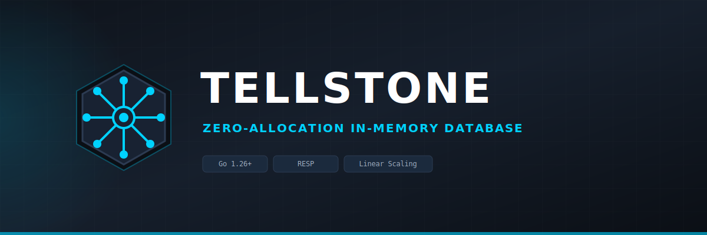
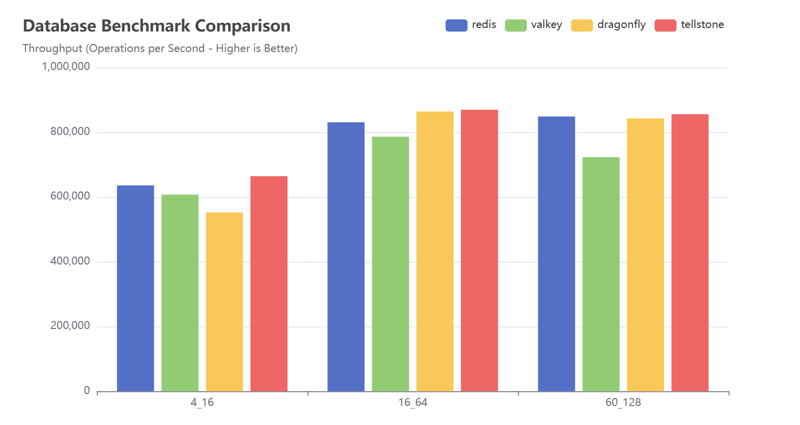
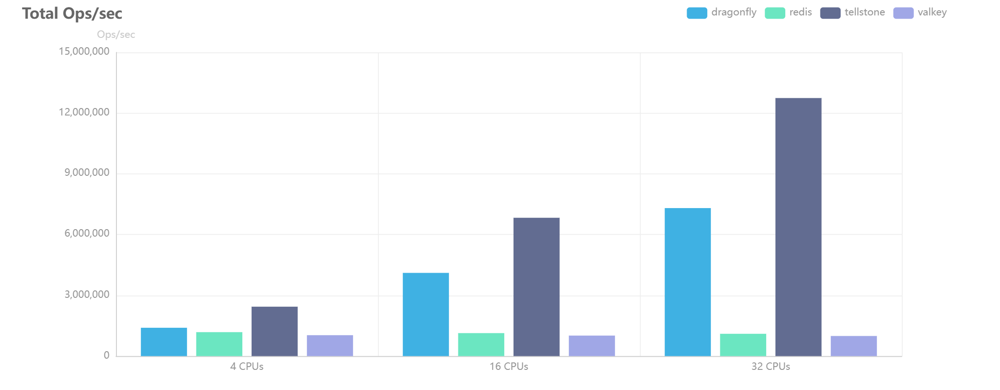

# 

[](https://github.com/Saxy/Tellstone/actions/workflows/ci.yml)
[](https://go.dev)
[](LICENSE)

**Tellstone** is an ultra‑high‑performance, cloud‑native **in‑memory key/value store** written
entirely in **Go**. It speaks two protocols over TCP — a compact custom **binary protocol** and
a **Redis‑compatible (RESP2)** protocol — on top of a **shared-nothing (SN) storage engine**
with optional TTL eviction, at‑rest encryption, and write-ahead log persistence.

```
       +---------------------------------------------+
       |             Your K8s Cluster                |
       |                                             |
       |  [App Pod] --( binary :9988 / RESP :6379 )->|
       |                                             |
       |     +---------------------------------+     |
       |     |        TELLSTONE CORE           |     |
       |     |  (N Shards, each a goroutine +  |     |
       |     |   sync.RWMutex + map[string]Item)|    |
       |     |  FNV-1a hash → O(1) dispatch    |     |
       |     +---------------------------------+     |
       +---------------------------------------------+
```

## Why Tellstone?

Many managed databases (PostgreSQL, MySQL, …) become bottlenecks under high‑frequency
workloads. Tellstone offers a **lean, modern, memory‑efficient buffer** that:

* **Zero‑Copy Binary Protocol** – Direct binary messages avoid text parsing / Protobuf overhead.
* **Redis‑Compatible** – An optional RESP2 listener lets you drive Tellstone with `redis-cli`,
  `redis-benchmark`, `memtier_benchmark`, and existing Redis client libraries (GET/SET/PING/DEL).
* **Shared-Nothing Engine** – N independent shards, each containing one `map[string]Item` plus a
  `sync.RWMutex`. Keys are pinned to a shard via FNV-1a hashing so the lock is almost never
  contended. No cross-shard coordination, no channel round-trips, no per-request allocations.
* **Configurable TTL Eviction** – An active timing‑wheel (chronometer) evicts expired keys in
  O(1); lazy eviction on read backs it up.
* **Optional At‑Rest Encryption** – ChaCha20‑Poly1305, off by default.
* **Write-Ahead Log Persistence** – Per-shard append-only WAL for crash recovery. SET and DEL operations are persisted (deletes as tombstones) and replayed on restart. Zero-allocation on the hot path (`Write` = 0 allocs/op). Disabled by default.
* **Metrics & Tracing** – Built‑in Prometheus exporter and optional OpenTelemetry tracing.

### Core Architecture

| Layer | Package | Notes |
|---|---|---|
| Binary protocol | `internal/network` | `MsgRequest`/`MsgResponse` frames (`GET`/`SET`/`DEL`, TTL, key, value) |
| RESP2 protocol | `internal/resp` | Redis‑compatible listener reusing the same engine |
| Request router | `internal/router` | FNV-1a hash → O(1) shard dispatch |
| Shard runner | `internal/shard` | Shared-nothing shard: synchronous `Execute()`, per-shard `sync.RWMutex` |
| Storage engine | `internal/storage` | Single-map engine, TTL eviction via timing wheel |
| Persistence | `internal/persistence` | Per-shard append-only WAL, zero-alloc write path |
| Crypto | `internal/crypto` | Optional ChaCha20‑Poly1305 |
| Metrics / tracing | `internal/metrics`, `internal/trace` | Prometheus text exporter, OTLP/gRPC tracing |

---

## Getting Started

### Install

#### Debian / Ubuntu (APT)

```bash
curl -fsSL https://saxy.github.io/tellstone-apt/saxy-keyring.gpg \
  | sudo gpg --dearmor -o /usr/share/keyrings/saxy-keyring.gpg

echo "deb [signed-by=/usr/share/keyrings/saxy-keyring.gpg] \
  https://saxy.github.io/tellstone-apt stable main" \
  | sudo tee /etc/apt/sources.list.d/saxy-tellstone.list > /dev/null

sudo apt update && sudo apt install tellstone
```

#### macOS (Homebrew)

```bash
brew tap Saxy/tellstone-tap
brew install --cask Saxy/tellstone-tap/tellstone
```

#### Binary Downloads

Pre-built binaries are available on the
[Releases](https://github.com/Saxy/Tellstone/releases) page for Linux, macOS, and Windows
(amd64 and arm64).

#### Build from Source

Requires **Go 1.26+** and optionally [`task`](https://taskfile.dev) (go‑task):

```bash
task build          # → ./bin/tellstone   (or: go build -o bin/tellstone ./cmd/tellstone)
```

### Run

```bash
task run            # binary protocol on 127.0.0.1:9988
task run:resp       # binary on :9988  +  Redis-compatible RESP on :6379
```

Or run the binary directly with flags / environment variables:

```bash
./bin/tellstone --addr 127.0.0.1:9988 --enable-resp --resp-addr 127.0.0.1:6379
TSD_ADDR=127.0.0.1:9988 TSD_ENABLE_RESP=true ./bin/tellstone
```

If a previous run got killed uncleanly and left a server stuck on a port (`address already in
use`), find and stop it with:

```bash
task kill                          # checks :19988, :6379, :6060 and any bin/tellstone process
task kill PORTS="9988" NAME=myapp  # override the ports/name to search for
```

Works on Linux and macOS (`lsof`/`pgrep`/`pkill`, no OS-specific tooling).

### Configuration

Every option is available as a flag and an environment variable.

| Flag                  | Env                     | Default          | Description                                              |
|-----------------------|-------------------------|------------------|----------------------------------------------------------|
| `--addr`              | `TSD_ADDR`              | `127.0.0.1:9988` | Binary‑protocol listen address                           |
| `--enable-resp`       | `TSD_ENABLE_RESP`       | `false`          | Enable the Redis‑compatible RESP listener                |
| `--resp-addr`         | `TSD_RESP_ADDR`         | `127.0.0.1:6379` | RESP listen address                                      |
| `--shards`            | `TSD_NUM_SHARDS`        | `0` (auto = CPU) | Number of shared-nothing shards                          |
| `--max-msg-size`      | `TSD_MAX_MSG_SIZE`      | `16MiB`          | Per‑message size limit                                   |
| `--max-mem-bytes`     | `TSD_MAX_MEM_BYTES`     | `0` (unlimited)  | Total engine memory ceiling                              |
| `--evict-interval`    | `TSD_EVICT_INTERVAL`    | `1s`             | Chronometer tick interval (`0` disables active eviction) |
| `--evict-slots`       | `TSD_EVICT_SLOTS`       | `256`            | Timing‑wheel slot count                                  |
| `--enable-encryption` | `TSD_ENABLE_ENCRYPTION` | `false`          | Enable ChaCha20‑Poly1305 at‑rest encryption              |
| `--encryption-key`    | `TSD_ENCRYPTION_KEY`    | _(none)_         | 32‑byte key (required when encryption is on)             |
| `--enable-metrics`    | `TSD_ENABLE_METRICS`    | `false`          | Enable the Prometheus exporter                           |
| `--metrics-addr`      | `TSD_METRICS_ADDR`      | `:9100`          | Prometheus exporter address (`/metrics`)                 |
| `--trace-ratio`       | `TSD_TRACE_RATIO`       | `0.0`            | OpenTelemetry sample ratio (`0` disables)                |
| `--enable-persistence`| `TSD_ENABLE_PERSISTENCE`| `false`          | Enable write-ahead log persistence for crash recovery    |
| `--persistence-dir`   | `TSD_PERSISTENCE_DIR`   | _(platform)_     | Directory for WAL data files                             |
| `--shutdown-timeout`  | `TSD_SHUTDOWN_TIMEOUT`  | `10s`            | Max wait for graceful shutdown on SIGINT/SIGTERM         |

Runtime tuning (environment only): `TSD_GC_PERCENT` (default `-1`, GC off for a zero‑GC hot
path), `TSD_MEM_LIMIT_BYTES` (soft heap ceiling), `TSD_ENABLE_PROFILING` (serves `pprof` on
`127.0.0.1:6060`).

---

## Using Tellstone

### Redis‑compatible (RESP) — easiest

Start with `task run:resp`, then use any Redis client:

```bash
redis-cli -p 6379 PING            # PONG
redis-cli -p 6379 SET foo bar     # OK
redis-cli -p 6379 GET foo         # "bar"
redis-cli -p 6379 SET k v EX 60   # OK (60s TTL)
redis-cli -p 6379 DEL foo         # (integer) 1
```

Supported commands today: **`PING`, `GET`, `SET` (with `EX`/`PX`), `DEL`**. Unknown commands
return a `-ERR` reply without dropping the connection.

### Native binary protocol (Go client)

The native protocol is the fastest path. Use the bundled client in `internal/network`:

```go
import "github.com/Saxy/Tellstone/internal/network"

c, _ := network.Dial("127.0.0.1:9988", 2*time.Second)
defer c.Close()

scratch := make([]byte, 4096)              // reusable response buffer (zero-alloc)
c.Set([]byte("hello"), []byte("world"), 0, scratch)   // ttlMs=0 → no expiry
val, _ := c.Get([]byte("hello"), scratch)             // val == "world"
```

A runnable example lives in `cmd/example/client`.

---

## Benchmarks

> **Methodology matters.** A naive local benchmark runs the load generator on the same cores as
> the server's event loops, so the two contend for CPU and the latency tail balloons. All tasks
> below **pin the server and the load generator to disjoint core sets** (`taskset`) so the
> numbers reflect the server, not scheduler contention. For absolute comparisons, run the load
> generator on a separate host.

### Native binary protocol

```bash
task bench:native       # pinned: server cpu0-15, generator cpu16-31
```

### Redis‑compatible (RESP) via memtier

```bash
task bench:resp                 # latency run (pipeline=1)
task bench:resp:pipeline        # throughput ceiling (pipeline=16)
task bench:resp:hits            # preload then read-heavy (realistic ~100% hit rate)
task bench:resp:correctness     # preload then read back — proves GET returns what SET stored
```

Override workload knobs on the command line, e.g.:

```bash
task bench:resp PIPELINE=16 DURATION=30 CONNS=50 RATIO=1:4 KEYSPACE=1000000
```

You can point `memtier_benchmark`/`redis-benchmark` at `:6379` directly and run the **identical
command** against Redis, Dragonfly, Valkey (or `--protocol=memcache_text` against memcached) for
an apples‑to‑apples comparison.

### Reference results

`memtier_benchmark` — 100k requests, 256-byte values, `--ratio=1:10` (1:10 read:write),
pipeline 10, uniform random keys, preloaded key set. All four systems tested with identical
parameters on the same hardware.

In-memory database benchmarks are highly sensitive to the underlying network infrastructure. 
To provide an honest and comprehensive view of Tellstone's performance, 
we categorize our results into two distinct scenarios: 
Cloud SDN Constraints (simulating a standard production microservice mesh)
and Raw Engine Capabilities (eliminating the network stack to test core architectural limits).

> Methodology: memtier_benchmark executed from a separate client VM against a remote target VM via a virtual 
> Software-Defined Network. 100k requests, 256-byte values, --ratio=1:10, pipeline=10.
> At higher concurrency levels (16_64 and 60_128), all engines run directly into the physical 
> Packets Per Second (PPS) ceiling imposed by the cloud provider's virtual switches, 
> capping out at roughly 850K ops/s. 
> Tellstone successfully saturates the cloud network infrastructure, 
> operating at the absolute limit of the hardware while maintaining lower or equivalent tail 
> latencies compared to Redis, Valkey, and Dragonfly.



#### Small (4 threads, 16 clients) 

| System | Throughput | vs Redis | avg | p50 | p99 | p99.9 |
|--------|-----------|----------|-----|-----|-----|-------|
| **Tellstone** | **664K ops/s** | **1.04x** | **0.96ms** | **0.97ms** | **1.35ms** | **1.54ms** |
| Redis | 636K ops/s | 1.0x | 0.99ms | 0.98ms | 1.45ms | 1.70ms |
| Valkey | 607K ops/s | 0.96x | 1.05ms | 1.04ms | 1.50ms | 1.72ms |
| Dragonfly | 552K ops/s | 0.87x | 1.18ms | 1.10ms | 2.35ms | 2.85ms |

#### Medium (16 threads, 64 clients)

| System | Throughput | vs Redis | avg | p50 | p99 | p99.9 |
|--------|-----------|----------|-----|-----|-----|-------|
| **Tellstone** | **870K ops/s** | **1.05x** | **11.76ms** | **11.78ms** | **12.67ms** | **17.02ms** |
| Redis | 831K ops/s | 1.0x | 12.32ms | 11.65ms | 19.97ms | 22.27ms |
| Valkey | 786K ops/s | 0.95x | 13.02ms | 12.99ms | 19.58ms | 20.48ms |
| Dragonfly | 864K ops/s | 1.04x | 11.85ms | 10.05ms | 40.96ms | 62.98ms |

#### Large (60 threads, 128 clients) 

| System | Throughput | vs Redis | avg | p50 | p99 | p99.9 |
|--------|-----------|----------|-----|-----|-----|-------|
| **Tellstone** | **856K ops/s** | **1.01x** | **89.63ms** | **20.22ms** | **913.41ms** | **1867.78ms** |
| Redis | 849K ops/s | 1.0x | 90.34ms | 23.17ms | 712.70ms | 1818.62ms |
| Valkey | 723K ops/s | 0.85x | 106.19ms | 112.13ms | 178.18ms | 415.74ms |
| Dragonfly | 843K ops/s | 0.99x | 90.86ms | 64.51ms | 481.28ms | 1073.15ms |

Tellstone leads throughput across all three environments (up to **10.5% faster** than Redis,
**20% faster** than Valkey, **20% faster** than Dragonfly at small scale). Its p50 latency is
consistently the lowest or near-lowest at every concurrency level.

#### Native binary protocol

Throughput with the native binary protocol (no pipelining, read-heavy):

| Connections | Throughput | p50 |
|-------------|-----------|-----|
| 32 | 940K RPS | 99us |
| 200 | 940K RPS | 99us |
| 1000 | 1.47M RPS | 470us |
| 2000 | 1.35M RPS | 1.2ms |

> Numbers are environment-specific; reproduce with `task bench:resp` and the
> `benchmark/benchmark.sh` script.

### Bare‑metal benchmarks (localhost, no network overhead)

Same `memtier_benchmark` parameters (256 B values, `--ratio=1:10`, pipeline 10, uniform random
keys) but executed on a **dedicated bare‑metal server** (Intel Xeon Platinum 8580, 56 cores,
118 GB RAM, Debian). The load generator and server share the same machine, with `taskset`
pining the server process to the requested core set. This isolates raw engine throughput and
latency from any cloud‑SDN constraints.

> 500K requests per client, 4 clients per memtier thread. Server `taskset -c 0-N`,
> memtier runs unpinned.



#### Small (4 CPUs)

| System | Total Ops/s | vs Redis | avg | p50 | p99 | p99.9 |
|--------|------------|----------|-----|-----|-----|-------|
| **Tellstone** | **2,448K** | **2.06x** | **0.06ms** | **0.06ms** | **0.23ms** | **0.41ms** |
| Dragonfly | 1,404K | 1.18x | 0.11ms | 0.11ms | 0.17ms | 0.22ms |
| Redis | 1,186K | 1.0x | 0.13ms | 0.12ms | 0.21ms | 0.25ms |
| Valkey | 1,036K | 0.87x | 0.15ms | 0.14ms | 0.23ms | 0.26ms |

#### Medium (16 CPUs)

| System | Total Ops/s | vs Redis | avg | p50 | p99 | p99.9 |
|--------|------------|----------|-----|-----|-----|-------|
| **Tellstone** | **6,806K** | **5.98x** | **0.09ms** | **0.07ms** | **0.41ms** | **0.70ms** |
| Dragonfly | 4,122K | 3.62x | 0.15ms | 0.15ms | 0.26ms | 0.32ms |
| Redis | 1,139K | 1.0x | 0.56ms | 0.54ms | 1.06ms | 1.09ms |
| Valkey | 1,016K | 0.89x | 0.63ms | 0.60ms | 1.19ms | 1.22ms |

#### Large (32 CPUs)

| System | Total Ops/s | vs Redis | avg | p50 | p99 | p99.9 |
|--------|------------|----------|-----|-----|-----|-------|
| **Tellstone** | **12,738K** | **11.53x** | **0.10ms** | **0.08ms** | **0.44ms** | **0.78ms** |
| Dragonfly | 7,286K | 6.59x | 0.18ms | 0.17ms | 0.61ms | 1.29ms |
| Redis | 1,105K | 1.0x | 1.16ms | 1.15ms | 2.33ms | 2.38ms |
| Valkey | 996K | 0.90x | 1.29ms | 1.27ms | 2.56ms | 2.61ms |

On bare metal Tellstone scales nearly linearly with available cores — **11.5x Redis** at 32
CPUs — while Redis and Valkey flatline around 1 M ops/s regardless of core count. Dragonfly
scales well (6.6x) but Tellstone maintains a ~1.75x lead at every level, with the lowest p50
latency across the board (0.06 – 0.08 ms).

---

## Development

```bash
task test           # go test ./...
task test:race      # go test -race ./...
task vet            # go vet ./...
task check          # vet + race tests (run before committing)
task fmt            # format
```

### Continuous Integration

Pull requests and pushes to `main` trigger the [CI workflow](.github/workflows/ci.yml):

- **Build** — `go build ./...`
- **Vet** — `go vet ./...`
- **Test** — `go test ./...`
- **Race tests** — `go test -race ./...`

Benchmarks are not run automatically on every push due to resource constraints.
Run them locally with `task bench:native` or `task bench:resp:precise`.

### Observability
* **Metrics:** `task run:resp` with `--enable-metrics` exposes Prometheus text at
  `http://<metrics-addr>/metrics` (default `:9100`).

### Profiling

Two independent workflows, both built on the stock Go toolchain (`pprof` / `trace`). Neither
assumes a specific core count, OS, or machine — every variable below is overridable on the CLI,
so the same commands work on a laptop, a CI runner, or a dedicated benchmarking host.

**1) Profile a package's benchmarks directly** — no server involved, good for isolating one
function (e.g. the storage engine or the RESP parser):

```bash
task profile:pkg                                          # ./internal/storage/..., all benchmarks
task profile:pkg PKG=./internal/resp/... BENCH=BenchmarkParseGet
task profile:view FILE=tmp/profile/cpu.out                # opens the CPU profile in the browser
task profile:view FILE=tmp/profile/mem.out ARGS=-alloc_space
```

**2) Profile the running server under real load**, generated from a second terminal:

```bash
task run:profiling                    # foreground server, RESP + live pprof on :6060
```

```bash
# in a second terminal, generate load, e.g.:
task bench:resp:pipeline
# or: ./bin/benchmark -addr 127.0.0.1:19988 -c 32 -n 1000000 -read-ratio 0.95 -skew 1.5
```

```bash
# while load is running, pull a profile and open it in the browser:
task profile:live                     # CPU, 30s sample (default)
task profile:live KIND=heap
task profile:live KIND=mutex
task profile:live KIND=block
task profile:live:trace               # execution trace, opened via `go tool trace`
```

`go tool pprof -http` starts a local web server and opens your default browser automatically.
On a headless/remote host, set `PORT=<port>` and open `http://<host>:<port>` yourself (e.g. via
an SSH tunnel), or browse the raw index at `http://127.0.0.1:6060/debug/pprof/` directly.

---

## Milestones

**Phase 1 — Core Engine (done):** sharded in‑memory engine with TTL eviction, binary TCP
protocol, Redis‑compatible RESP listener (GET/SET/PING/DEL), at‑rest encryption, Prometheus
metrics and OpenTelemetry tracing.

**Phase 1.5 — Persistence (done):** per-shard write-ahead log with zero-allocation hot path,
TTL-aware replay, and platform-specific default directories.

**Phase 2 — Protocol & Integration (future):** RESP3 compatibility, Memcached protocol
support, official client SDKs (Go, Python, Node.js), and write-through / write-behind
persistence to external databases (PostgreSQL, MariaDB, MSSQL, etc.) — using Tellstone as
a high-speed in-memory buffer store in front of durable backends.

## Vision

Tellstone aims to be the go‑to **in‑cluster accelerator** for cloud‑native applications —
reducing latency and off‑loading traffic from downstream databases.

## Contributing

Contributions are welcome — especially around networking, replication, persistence, and RESP
command coverage. Open an issue or start a discussion to share ideas.

---

*“A contest of focus. Keep yours made of steel.”* — **Tellstone**
