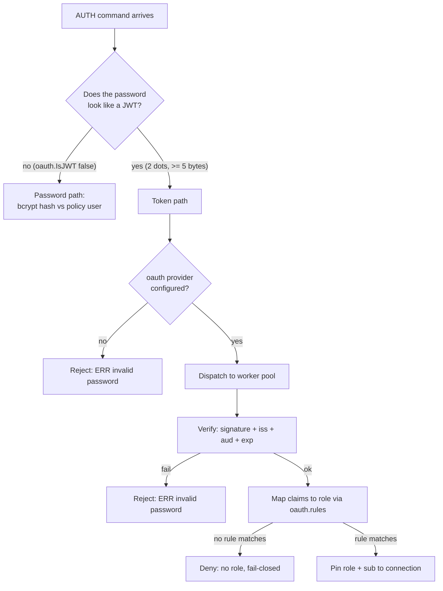
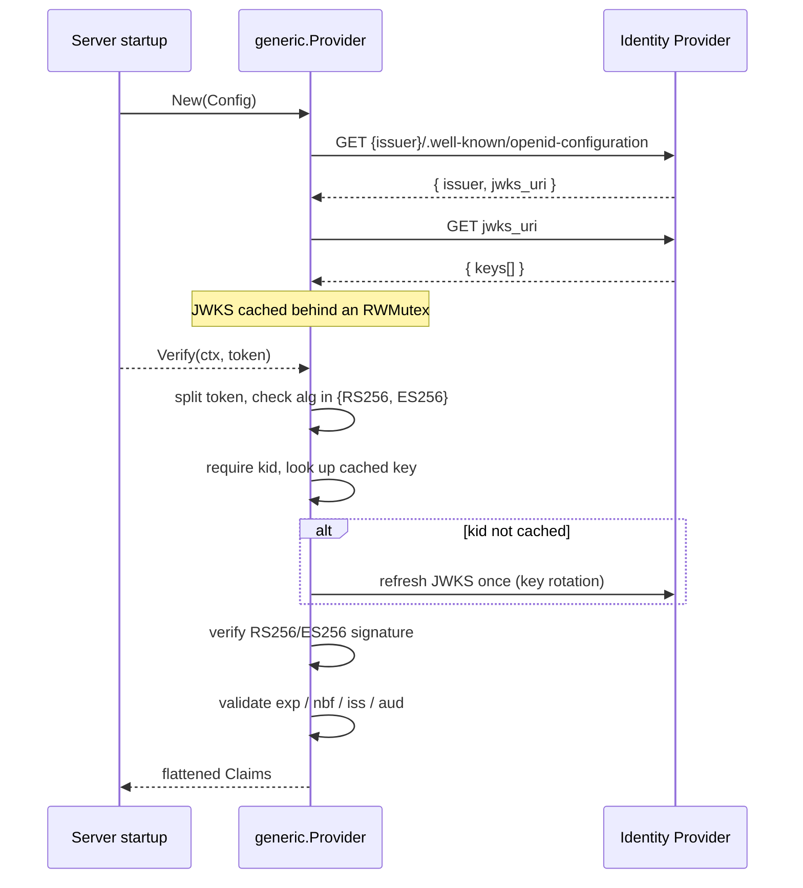

# Tellstone OAuth — Connection-Time Token Authentication

`internal/oauth` plugs federated identity into Tellstone's `AUTH` step. Instead of — or in
addition to — a shared `--require-pass` password or per-user bcrypt hashes, a client can present
an **OpenID Connect (OIDC) `id_token`** (a signed JWT) as its credential. The token's claims are
mapped to an RBAC role via the policy file's `oauth.rules`, and that role is pinned to the
connection exactly like a password-authenticated session.

The feature is **opt-in and zero-overhead when disabled**: with no `--oauth-*` flag configured,
the provider is `nil`, no code path changes, and `AUTH` behaves exactly as before.

---

## How a presented credential is routed

Both the RESP and binary listeners run the same dispatch on every `AUTH`:



`oauth.IsJWT` is deliberately **shape-only**: a well-formed but forged token still fails in
`Verify`. The heuristic exists purely to keep the password path fast — a real password never
contains two dots in this layout and never needs a signature check.

Verification runs on the listener's **bounded auth-worker pool** so the network event loop never
blocks on a cryptographic or network operation. If the pool is saturated, the connection fails
`AUTH` synchronously instead of stalling.

---

## The `Provider` contract

`internal/oauth/oauth.go` defines the seam every identity provider implements:

```go
type Provider interface {
    Config() Config                       // static parameters (issuer, client id)
    Verify(ctx context.Context, token []byte) (Claims, error)
}

type Claims map[string][]string           // normalized claim set
type Config struct {
    Issuer   string                       // OIDC discovery base URL
    ClientID string                       // expected `aud` (empty skips the check)
    Scopes   []string                     // informational, not enforced
}
```

Key contract points:

- **Claims are maps of slices.** JWT claims may repeat or be structured lists (`groups`,
  `roles`); this is the exact shape `oauth.rules` matching consumes, so implementations must not
  flatten lists.
- **Concurrency-safe.** A single `Provider` instance is shared by every connection worker and is
  verified concurrently.
- **Two error classes.** Any authentication failure returns `oauth.ErrInvalidToken`
  (wrap it, don't replace it — callers find it via `errors.Is`). A *transient* failure such as an
  unreachable identity provider is returned unwrapped, so a caller can tell "bad credential" from
  "IdP down" and decide how to treat the connection.
- **No secrets in `Config`.** Client secrets and private keys are sourced from the environment or
  files at startup, never baked into a preset or the RBAC policy file. Server-side token
  verification is **signature + issuer + audience** based, so no client secret is needed at all.

---

## Providers and the registry

Providers register by name (`internal/oauth/registry.go`), and `server` looks one up at startup
via the `--oauth-provider` flag. Registration is first-wins and never panics: a duplicate,
empty, or nil registration is logged and rejected, leaving the working provider intact. The map
is populated before serving and read-only afterward, so reads are lock-free.

| Name | Package | What it does |
|------|---------|--------------|
| *(generic)* | `internal/oauth/generic` | Any OIDC issuer. Selected when `--oauth-provider` is empty and `--oauth-issuer` is set. |
| `google` | `internal/oauth/presets` | Google preset: default issuer `https://accounts.google.com`, adds a `groups` claim from the `hd` (hosted-domain) claim. |
| `stackit` | `internal/oauth/presets` | STACKIT IAM preset: default issuer `https://accounts.stackit.cloud`. |

### The generic OIDC provider

`generic.New` is the reference implementation and the engine behind every preset. It is written
against the standard library only and follows a fail-fast, allocation-light shape:



Security properties enforced in `generic.Verify`:

- **Algorithm allowlist** — only `RS256` and `ES256`. The `HS*` family is rejected outright:
  a symmetric MAC would accept raw key material as a secret (algorithm-confusion attacks).
- **`kid` required** — the signing key is looked up unambiguously; a token without one is
  rejected rather than tried against every key.
- **Key rotation without restarts** — a missed `kid` triggers exactly one JWKS refresh before
  giving up.
- **Temporal checks** — `exp` and `nbf` are enforced when present.
- **Issuer/audience** — `iss` is compared against `Config.Issuer` and `aud` against
  `Config.ClientID` when configured; `aud` matches a single string or a list (both are valid
  OIDC forms).
- **Fail-fast discovery** — `New` performs the discovery and JWKS fetch synchronously, so a
  wrong issuer or unreachable IdP is reported at startup, before the first `AUTH`.

Presets (`google`, `stackit`) are thin wrappers: they fill in a default issuer and scopes, call
`generic.New`, and may post-process claims. Google maps the `hd` claim into `groups` so a
hosted-domain policy rule (`claim: groups, match: "*@example.com"`) works with a single line.

---

## Configuration

Flags (each with a `TSD_*` environment fallback — see `config/config.go`):

| Flag | Env | Meaning |
|------|-----|---------|
| `--oauth-provider` | `TSD_OAUTH_PROVIDER` | Preset name: `google`, `stackit`; empty + `--oauth-issuer` → generic OIDC |
| `--oauth-issuer` | `TSD_OAUTH_ISSUER` | OIDC discovery base URL of the identity provider |
| `--oauth-client-id` | `TSD_OAUTH_CLIENT_ID` | OAuth2 client ID used as the expected token audience |

Startup rules (`server.initOAuth`):

- **No flag → provider is `nil`**, password-only `AUTH` stays untouched.
- **`--oauth-provider google` / `stackit`** → preset constructor, which runs discovery eagerly.
- **`--oauth-provider` empty + `--oauth-issuer` set** → generic OIDC.
- **Unknown provider name** → startup error.
- **Token auth without `--rbac-config`** → startup error: a token can only map to a role through
  the policy's `oauth.rules`, so enabling it without a policy would silently deny every
  connection.

```bash
./bin/tellstone --rbac-config policy.yaml \
  --oauth-provider google \
  --oauth-client-id 1234-abc.apps.googleusercontent.com
```

No `--oauth-client-secret` exists by design. `Verify` needs only the issuer, the audience, and
the public JWKS.

A runnable example lives at `cmd/example/oauth` (policy + client that presents an id_token and
proves the pinned role): start a server with `--rbac-config cmd/example/oauth/policy.yaml
--oauth-provider google --oauth-client-id <id>`, then run the example with a token.

---

## Mapping claims to roles

The RBAC policy file carries an `oauth` section. Each rule names a claim and a match pattern and
points at a role; rules are applied **in file order and the first match wins**:

```yaml
roles:
  - name: admin
    rules: ["+@all", "~*"]
  - name: limited
    rules: ["+get", "~*"]
oauth:
  rules:
    - claim: email
      match: "*@saxy.dev"        # trailing glob: any local-part at this domain
      role: admin
    - claim: groups
      match: "admins"            # exact value match
      role: admin
    - claim: sub
      match: "default"           # bare "*" would match any value
      role: limited
```

Match patterns allow an **exact value**, a **leading `*` glob** (suffix match), or a **trailing
`*` glob** (prefix match). A middle wildcard is rejected at policy load, so a typo surfaces
before it silently denies access. Rules are compiled at load time — an unknown target role fails
the load.

At `AUTH` time (`rbac.Store.ResolveOAuthToken` → `PolicyStore.RoleForClaims`):

1. The token's claims are verified by the provider.
2. `oauth.rules` are scanned in order; the first claim/value match yields the role.
3. The connection's identity (`username`/audit subject) is the token's **`sub`** claim,
   falling back to `"default"`.
4. **No match, or verification failure, means no role** — and a session with no role is
   deny-all (fail-closed). The client receives the same `ERR invalid password` as a bad
   password, so nothing reveals that the IdP path exists.

---

## Per-connection behavior

A successful token `AUTH` is indistinguishable from a password `AUTH` downstream: the resolved
role is pinned to the connection for its lifetime, subsequent commands are gated by the same
`IsAllowed` bitset as every other session, and `acl_deny` / `auth_*` audit events carry the
token's `sub` as the user. A policy hot-reload (SIGHUP) never re-evaluates a pinned session.

Failure accounting is identical to the password path: failed attempts count against the
per-connection limit (the listener closes the connection after the maximum), are recorded in the
audit trail, and are surfaced by `ACL LOG`.

---

## Performance and concurrency notes

- `Verify` is **local and allocation-light** after discovery: signature check + claim validation
  against the cached JWKS. The only network call is a one-time JWKS refresh when a new `kid`
  appears.
- The JWKS cache sits behind an `RWMutex`; lookups take the read lock and never block writers.
  The whole key set is replaced on refresh — individual entries are never mutated in place.
- Verification runs on the auth-worker pool, off the network event loop.
- AUTH payloads can be large (real `id_token`s are routinely > 1 KB). The bundled binary client
  falls back to a heap buffer when the credential exceeds its 512-byte stack buffer, so bearer
  tokens work over both protocols.
